# Portfolio Demonstrating Peter Mitchell's Work

## Media Links

<a href="https://www.linkedin.com/in/petermitchell0001" target="_blank">LinkedIn</a> | <a href="https://github.com/Squirrelbear" target="_blank">GitHub</a> | <a href="https://www.facebook.com/petejm01" target="_blank">Facebook</a> | <a href="https://twitter.com/Squirrelbear1" target="_blank">Twitter</a>   <a href="https://www.youtube.com/channel/UCVpOx4ucRLUmX5Cx66kmyLA" target="_blank">YouTube (Professional)</a> | <a href="https://www.youtube.com/channel/UCBSBiO8jZeZJ7YcequpRmGA" target="_blank">YouTube (Personal Gaming)</a>
  <a href="https://raw.githubusercontent.com/Squirrelbear/Portfolio/main/Resume_PeterMitchell.pdf" target="_blank">Resume</a>

## Projects Overview

The following list of projects is a selection from those I have worked on in the past years. Some provide links to the repositories if I have made them public or provide a brief description. 

<ul>
	<li><a href="#c-projects">C++ Projects</a></li>
	<li><a href="#java-projects">Java Projects</a></li>
	<li><a href="#xna-projects">XNA Projects</a></li>
	<li><a href="#unity-projects">Unity Projects</a></li>
	<li><a href="#mobile-application-projects">Mobile Application Projects</a></li>
	<li><a href="#other-projects">Other Projects</a></li>
	<li><a href="#publications-and-documents">Publications and Documents</a></li>
	<li><a href="./tenexamples">10 Specific Examples</a> (opens a separate page)</li>
</ul>

## C++ Projects

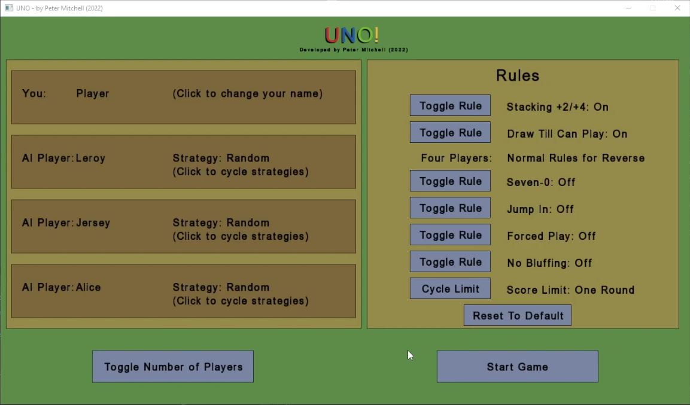 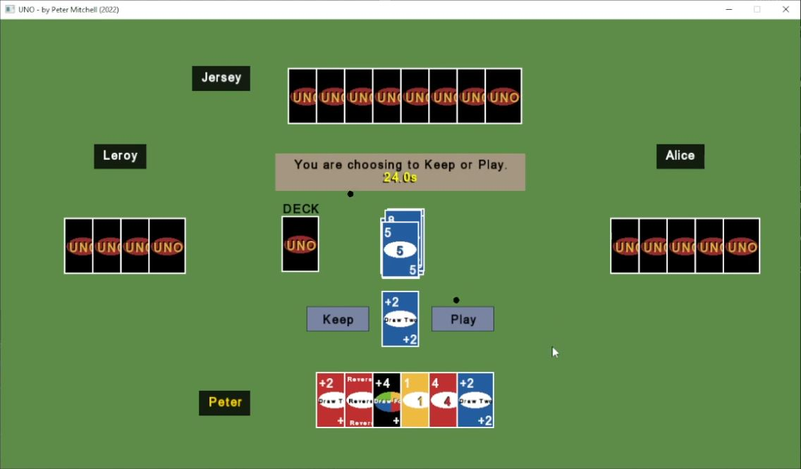 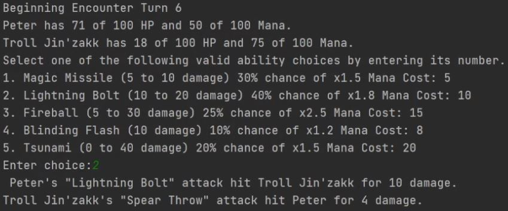

* **Uno using SFML**: ([Github Link](https://github.com/Squirrelbear/Uno-CPP)) ([C++ Version Youtube Demo](https://youtu.be/FrpcG1bfcx4)) ([Java Version Youtube Demo](https://youtu.be/6feJMIqSF98)): A recreation using SFML of Uno based on the version I wrote with Java (found under the Java heading). The game implements all the core rules of Uno, including many options presented by the official game on Steam. The game’s flow is controlled by generating dynamic trees for behaviour. AI effectively plays the game and is designed to interpret their decisions with the illusion of taking time to give a better game feel.
* **RPG Text Game C++ Edition**: ([Github Link](https://github.com/Squirrelbear/RPGTextGameCPP)) ([Youtube Demo](https://youtu.be/g24PpN2EcsE)): A simple text-based game that consists of map navigation using word entry with random encounters generated from data where the user fights using mana to cast spells against wolves, orcs, and trolls. This is an improved version from a Java version I wrote with a complete step-by-step walkthrough to let students create their own using the Java language.

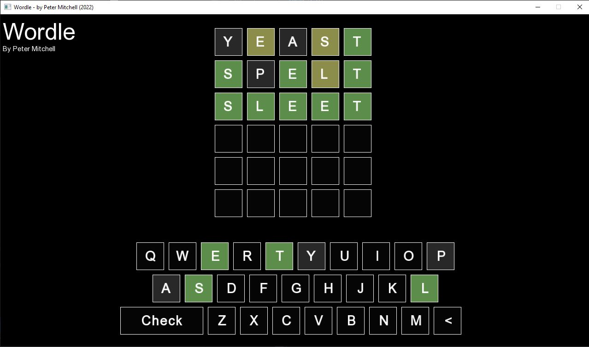 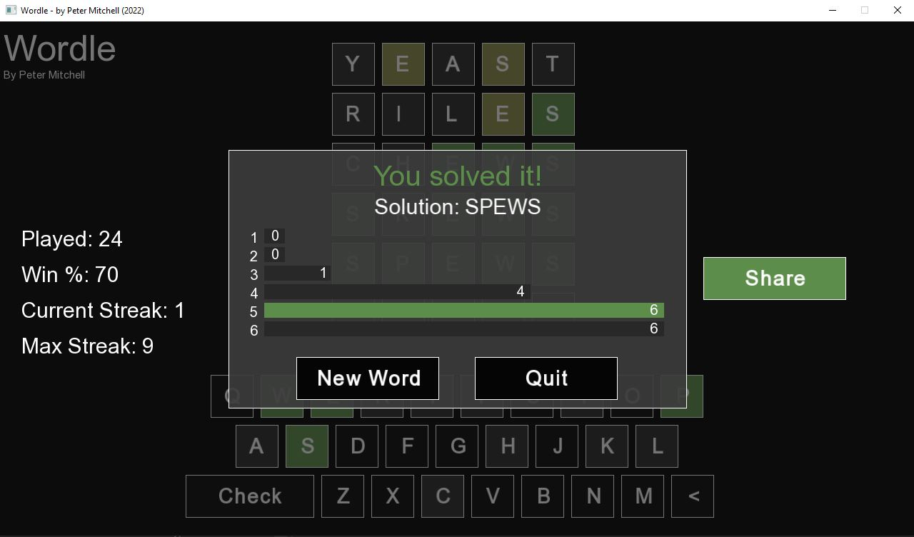

* **Wordle using SFML**: ([Github Link](https://github.com/Squirrelbear/Wordle-CPP-SMFL)) ([Youtube Demo](https://youtu.be/18llxWL9dl4)) ([Youtube Full Code Walkthrough](https://youtu.be/XJdb2gwaB3E)): An implementation of the game Wordle following a similar visual style to the original creator's developed using SFML.
* **Wordle Solver**: ([Github Link](https://github.com/Squirrelbear/Wordle-Solver)) ([Youtube Demo](https://youtu.be/18llxWL9dl4)): A simple text application to solve Wordle puzzles by reducing the data set via entering rules.
* **Summer Scholarship SSVEP Flashing Stimulus**: ([Github Link](https://github.com/Squirrelbear/SSVEP-FlashingStimulus)): I developed a collection of resources during a summer research scholarship at Flinders where I was tasked with developing software to provide a configurable flashing stimulus for SSVEP BCI experiments. Primarily uses C++ and DirectX11.
* **BigInt Reverse Polish Notation (RPN) Calculator**: (Project content available upon request.) My code is currently the server-side solution for automated testing against student code for a second-year programming university topic. It supports an arbitrary number of valid RPN ordered math using multiplication, division, addition, and subtraction with any number digits (default 256).
* **Cards Against Humanity CLI Client (WIP)**: ([Github Link](https://github.com/Squirrelbear/CardsAgainstHumanityCPPCLIClient)): I have developed a Cards Against Humanity client/server application by having the C++ based client communicate with a NodeJS based server via HTTP with JSON responses representing the game state. This project works as a proof of concept that I intend to expand with a GUI for more dynamic gameplay.
* **Cards Against Humanity NodeJS Server (WIP)**: ([Github Link](https://github.com/Squirrelbear/CardsAgainstHumanity-NodeJSServer)): Server code pairing with the above. Although not C++, this NodeJS server handles queries to it with validation to manage an arbitrary number of active game sessions with an automatic session timeout with no interaction, user authentication, and JSON responses to all requests.

## Java Projects

I have developed all the games listed under Java Projects to make them easier to code for students. None of the games use any sprites; they are all rendered by making draw calls directly onto JPanels. A couple of non-game related projects are listed first.

* **Java Test Framework**: ([Github Link](https://github.com/Squirrelbear/Java-Test-Framework)): A tool to allow students to test the output of their university practical code.

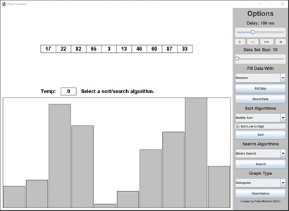

* **Data Visualiser** ([Github Link](https://github.com/Squirrelbear/DataVisualiserPractical)) ([Youtube Practical Intro](https://youtu.be/Co_E2fda4Nw)): A practical designed for students to visually observe searching and sorting algorithms. Uses multithreading and reflection to give students a responsive plug and play experience.

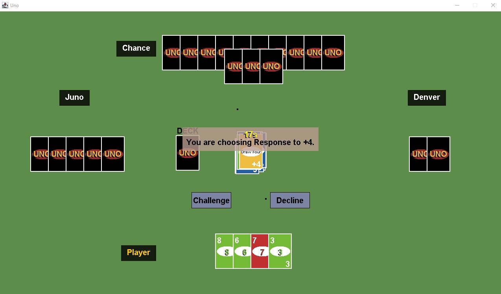 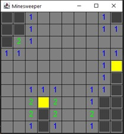 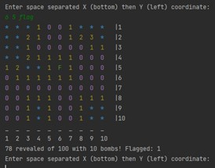 

* **Uno**: ([Github Link](https://github.com/Squirrelbear/Uno))  ([Youtube Demo](https://youtu.be/6feJMIqSF98)): A clone functionally similar to the official Uno game on Steam played vs AI.
* **Minesweeper**: ([Github Link](https://github.com/Squirrelbear/Minesweeper)) ([Youtube Demo](https://youtu.be/DvsNwkEJrzc)): Designed as both a GUI and CLI with step by step instructions for students.

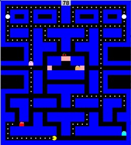 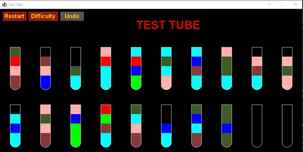 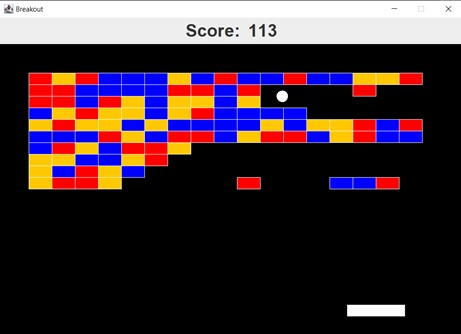 

* **Pacman**: ([Github Link](https://github.com/Squirrelbear/Pacman)) ([Youtube Demo](https://youtu.be/tH0pUULsx2o)): An implementation of the classic Pacman game with the best known level. AI is designed to mimic original logic.
* **TestTube**: ([Github Link](https://github.com/Squirrelbear/TestTube)) ([Youtube Demo](https://youtu.be/vdU5us7QbQY)): A clone of a water puzzle game where the aim is to fill test tubes fully with single colours.
* **Breakout**: ([Github Link](https://github.com/Squirrelbear/Breakout)) ([Youtube Demo](https://youtu.be/4UtAEuN2wGE)): A simple breakout clone with a bouncing ball and bricks with varying numbers of hits necessary to break them.

 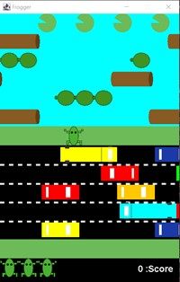 

* **Match 3 Game**: ([Github Link](https://github.com/Squirrelbear/Match3Game)) ([Youtube Demo](https://youtu.be/YxQATWG95i0)): A game with similar functionality to classics like Bejeweled.
* **Frogger**: ([Github Link](https://github.com/Squirrelbear/Frogger)) ([Youtube Demo](https://youtu.be/Exx21n8kh3w)): Simple Frogger game where you try and get 4 frogs over a busy road and over water with logs and turtles.
* **RPG Text Game**: ([Github Link](https://github.com/Squirrelbear/RPGTextGame)) ([Youtube Demo](https://youtu.be/7o3ZetXnE3g)): A CLI RPG game where you traverse an ASCII map and try to clear all encounters that have turn-based combat where you use mana to cast abilities to defeat the enemies. The game is designed with a step by step set of instructions included to allow students to complete everything themselves.
* **FlappyBlock**: ([Github Link](https://github.com/Squirrelbear/FlappyBlock)) ([Youtube Demo](https://youtu.be/JSSfoseU8CQ)): A simplistic take on Flappy Bird where you play as a flying block. 
* **Blackjack**: ([Github Link](https://github.com/Squirrelbear/Blackjack)): A text-based game playing Blackjack against the computer.

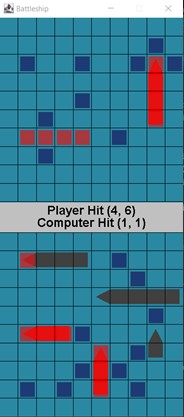 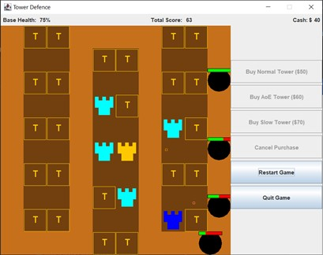 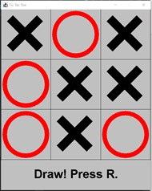

* **Battleship**: ([Github Link](https://github.com/Squirrelbear/Battleship)) ([Youtube Demo](https://youtu.be/BaLBZEwchQY)): Battleship played against AI with three levels of difficulty posing increasing levels of challenge.
* **Tower Defence Game**: ([Github Link](https://github.com/Squirrelbear/TowerDefenceGame)) ([Youtube Demo](https://youtu.be/llbEwzDPGMo)): This is a simple tower defence game that focuses on the essential elements with three types of towers and three types of enemies.
* **TicTacToe**: ([Github Link](https://github.com/Squirrelbear/TicTacToe)) ([Youtube Demo](https://youtu.be/uv9m0cjglIY)): Tic Tac Toe with the ability to play against a simple AI or against another player.

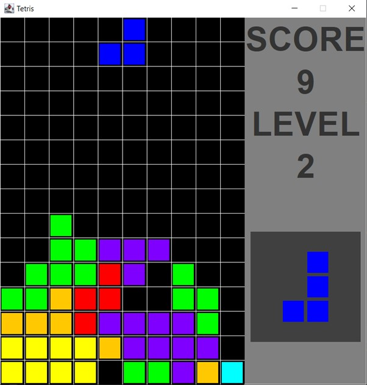 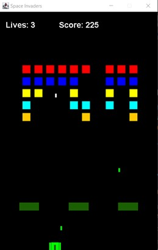 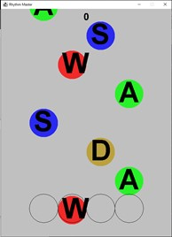 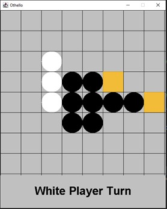

* **Tetris**: ([Github Link](https://github.com/Squirrelbear/Tetris)) ([Youtube Demo](https://youtu.be/8Sry1YbaXWY)): A simple Tetris clone that focuses on providing the core experience.
* **Space Invaders**: ([Github Link](https://github.com/Squirrelbear/SpaceInvaders)) ([Youtube Demo](https://youtu.be/LGGnLAnUXvg)): Has enemies moving down to invade while the player fires back at them with a simple tank.
* **Snake**: ([Github Link](https://github.com/Squirrelbear/Snake)) ([Youtube Demo](https://youtu.be/EI8MILz4auI)): Apples spawn in 3s and can be eaten by the snake to grow in length and gradually move faster.
* **Rhythm Master**: ([Github Link](https://github.com/Squirrelbear/RhythmMaster)) ([Youtube Demo](https://youtu.be/4x6l2AiYHOM)): Similar to games like Guitar Hero where you have to press keys close to the transition point at the bottom of the screen. Score is granted based on how well keys are pressed.
* **Pong**: ([Github Link](https://github.com/Squirrelbear/Pong)) ([Youtube Demo](https://youtu.be/b3IgHdTLo8k)): 2 player pong, played using the keyboard.
* **Othello**: ([Github Link](https://github.com/Squirrelbear/Othello)) ([Youtube Demo](https://youtu.be/gIGlct4bAQs)): The game Othello played against either another player or the computer. You play by placing pieces of your colour in positions to capture pieces of the other colour.
* **Master Mind**: ([Github Link](https://github.com/Squirrelbear/MasterMind)) ([Youtube Demo](https://youtu.be/WPtMUdLuFFg)): Played by making guesses and making informed changes to guesses from knowing the number of pieces that are correct based on colour and/or position.

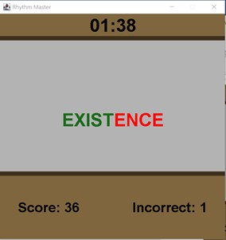 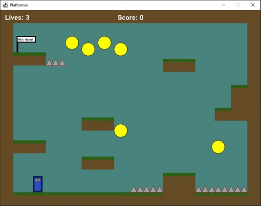

* **Word Master**: ([Github Link](https://github.com/Squirrelbear/WordMaster)) ([Youtube Demo](https://youtu.be/sClFZwInyvM)): A typing game where you try to type as many words as possible, as fast as possible, with as much accuracy as possible.
* **Driving Simulator**: ([Github Link](https://github.com/Squirrelbear/DrivingSimulatorJava)): A mouse controlled game where you change lanes to dodge as many oncoming cars as possible. Includes cheat codes to swap to using sprites and other visual changes.
* **Car Dodger**: ([Github Link](https://github.com/Squirrelbear/CarDodger)): This game is a mimic of the base game (no cheats) from Driving Simulator with a similar code design to many of the other examples seen here.
* **Platformer**: ([Github Link](https://github.com/Squirrelbear/Platformer)) ([Youtube Demo](https://youtu.be/ctRTWqbMZ9g)): A simple platformer with platforms, collectibles, spikes, and an endpoint.
* **Construction Quotation Assistant**: ([Github Link](https://github.com/Squirrelbear/Construction-Quotation-Assistant)): A group project using Java developed during Software Engineering 3 where the focus was on ensuring code supported test cases and then testing the code of other groups.

## XNA Projects

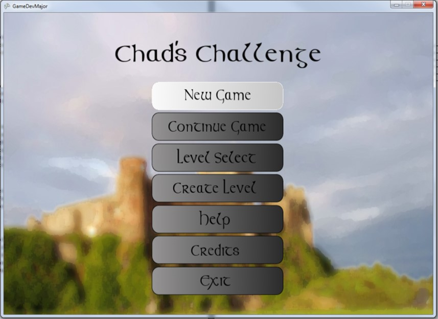 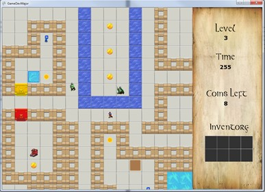 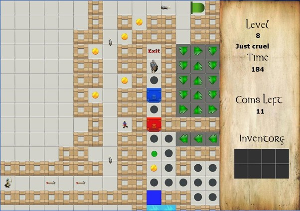

* **Chad's Challenge**: ([Github Link](https://github.com/Squirrelbear/ChadsChallengeDemoCopy)) ([YouTube Level Editor Demo](https://youtu.be/dIvHmNC0zoc)) ([Youtube Gameplay Demo](https://youtu.be/BkuVXLOpa20)): A group project I led while simultaneously developing Stargate Galaxy (under Unity Projects). The game cloned the mechanics of Chip's Challenge while also adding new enemies, mechanics, and a level editor. I was responsible for managing the team, approving code merges, developing the core game systems, including data structures and methods for the editor, and designing custom levels, among other roles.
* **XNA Tools**: ([Github Link](https://github.com/Squirrelbear/XNATools)): XNA Tools is a framework for simplifying development in XNA. Developed from some code I wrote part of Chad's Challenge, and then used in Kirby Arena, Splashboard, my Honour's project, and a number of other projects.

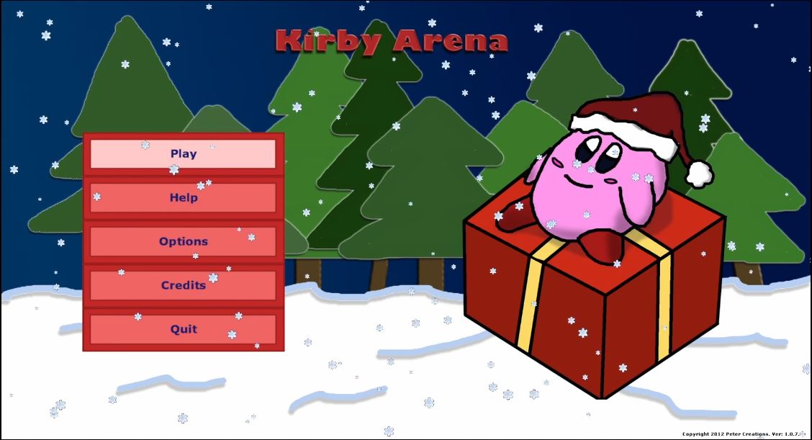 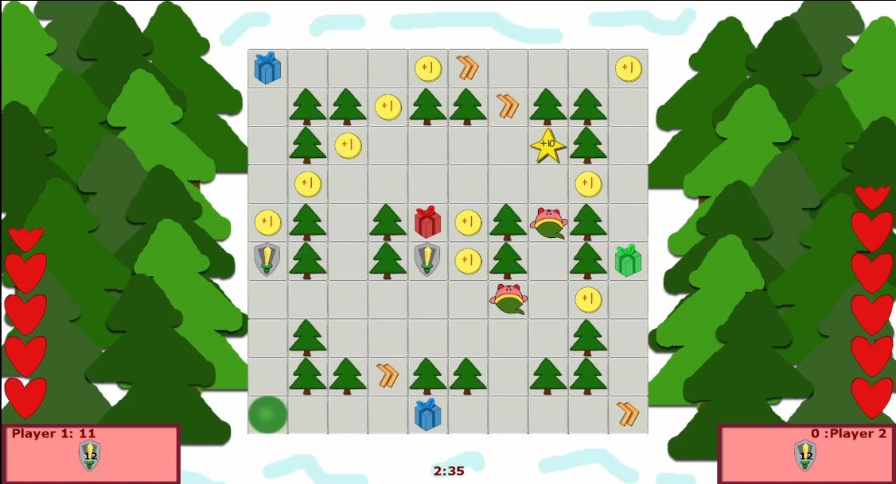 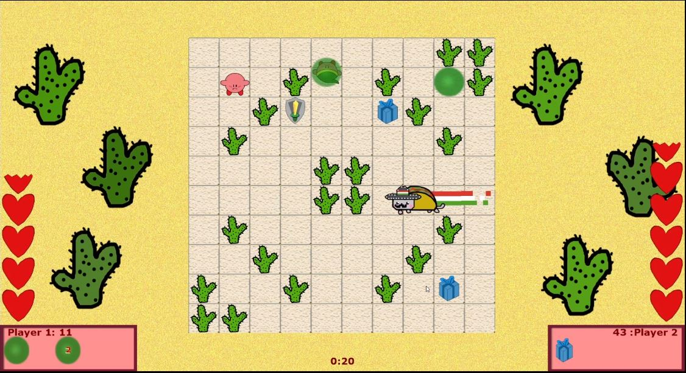

* **Kirby Arena**: ([Github Link](https://github.com/Squirrelbear/KirbyArenaPublic)) ([Youtube Demo](https://youtu.be/oxCJZz_r7_4)): A quirky battle game where Kirby fights Kirby with any combination of AI vs AI, Player vs Player, or Player vs AI. Uses my XNA tools as a framework and has four different levels with various powerups and ways to win.
* **Splashboard**: ([Vimeo Example Gameplay](https://vimeo.com/user19868725)) (Kinect Virtual Art Program): Not a program I developed myself, but I provided my XNA Tools as the framework and assisted with converting the original C++ code into C#. Along with extending the library to provide additional support for necessary functions requested.

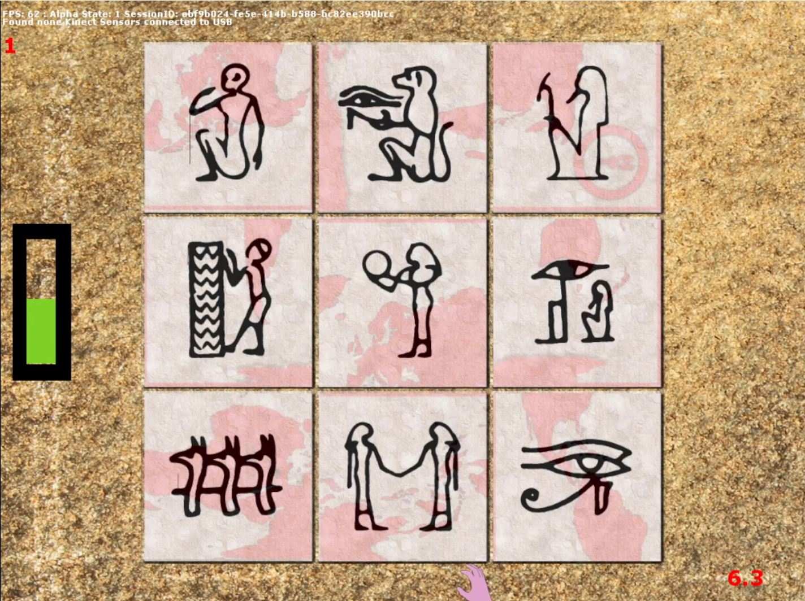 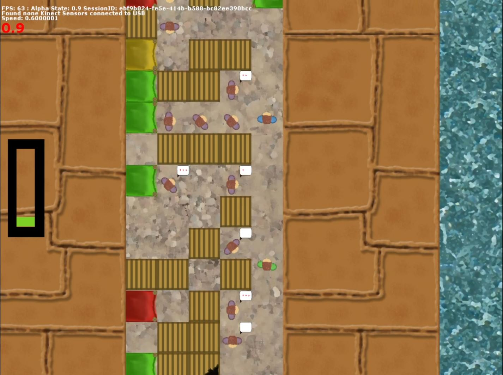 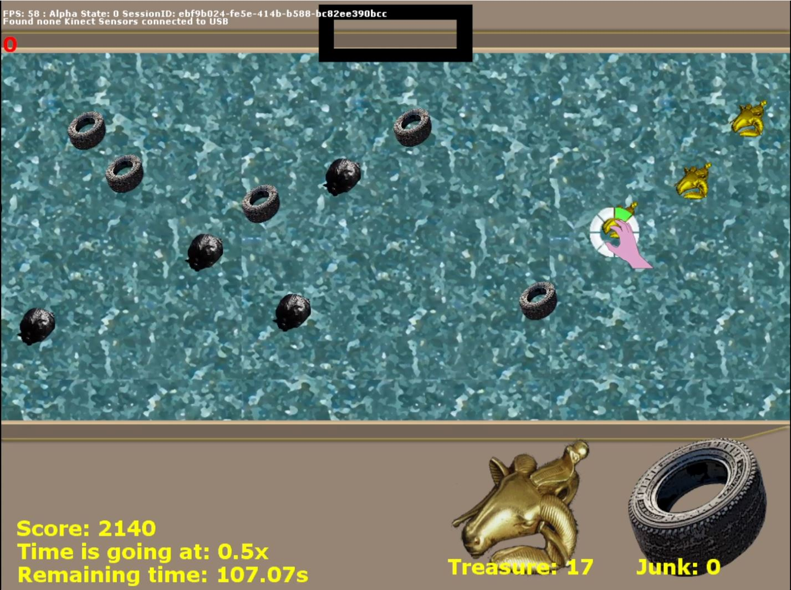

* **Honours Project**: ([Github Link](https://github.com/Squirrelbear/Honours-BCI-and-Kinect-Game)) ([Youtube Demo](https://youtu.be/CxklsQ8ch8A)): My honours project investigated the use of relaxation/concentration by using the Emotiv Epoc BCI interface combined with gesture detection with the Microsoft Kinect and voice commands via the Microsoft Kinect using their speech libraries. I developed custom algorithms with three games that effectively used the inputs and tested them on participants.

* **XNA Kinect Lecture 2013**: ([Github Link](https://github.com/Squirrelbear/GameDevelopment2013-XNAKinectLecture)): A lecture I presented in 2013 introducing using XNA and the Microsoft Kinect for a Game Development topic. The lecture covers an introduction to the Microsoft Kinect with what sensors it has and had practical examples of how to use it.
* **Overrun City**: ([Github Link](https://github.com/Squirrelbear/Overrun-City)): A single tiny level 2D shooter where the player must enter a code by shooting the numbers. Developed as a mini-project during a 3rd year uni game development topic to demonstrate knowledge of using XNA with C#. 

## Unity Projects

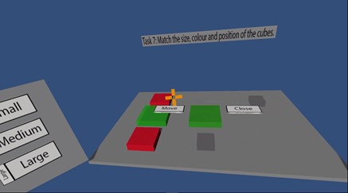 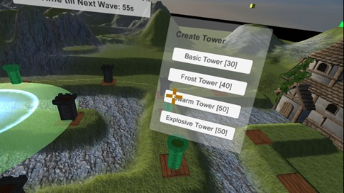 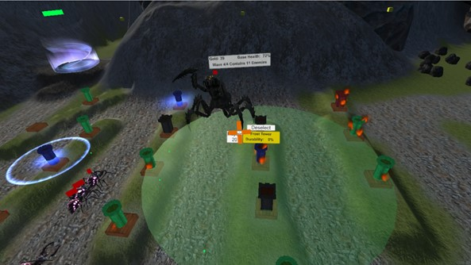

* **PHD Experiment 1**: ([Github Link](https://github.com/Squirrelbear/PhD-First-Experiment)) ([Youtube Demo](https://youtu.be/OF3ZlTPa5rg)): A prelimary study into using VR for object manipulation and interaction. 
* **PHD Experiment 2**: ([Github Link](https://github.com/Squirrelbear/SecondExperimentPhD)) ([Youtube Demo](https://youtu.be/6USVv6UwX9Y)) ([Youtube Game Trailer](https://youtu.be/7R2cSl9IyD8)): A prototype test of my Periphery Vision Menu System with VR including calibration evaluation, and a tower defence game.
* **PHD Experiment 3**: ([Github Link](https://github.com/Squirrelbear/ThirdExperimentPhD)) ([Youtube Demo](https://youtu.be/SKLK-2wC5jM)) ([Youtube Game Trailer](https://youtu.be/bVtB0wj8ehI)): An improved prototype test of my Periphery Vision Menu System with VR including object manipulation and a tower defence game.

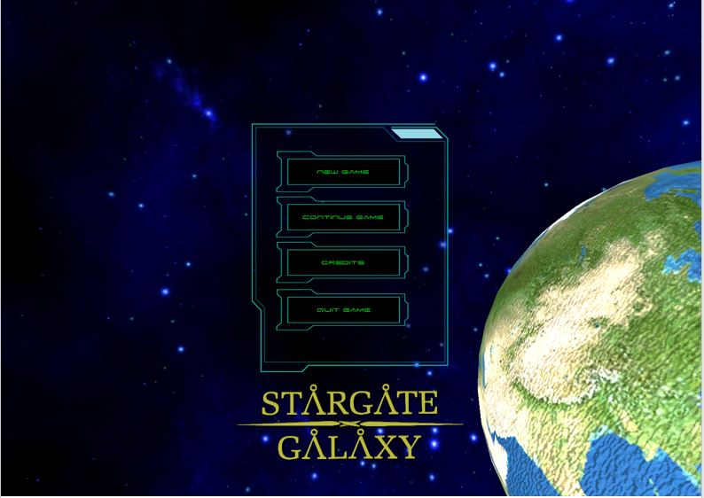 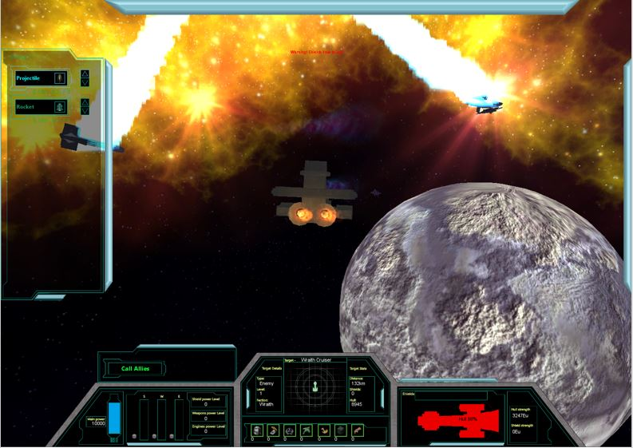 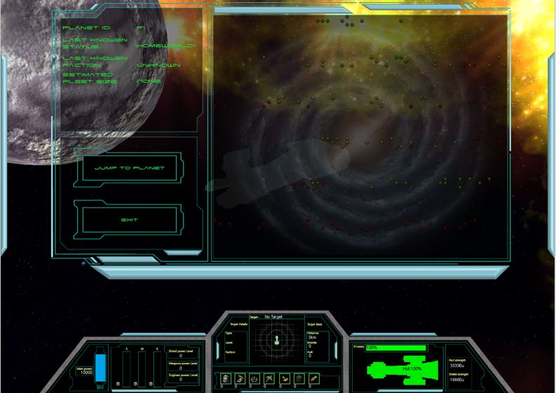

* **Stargate Galaxy**: ([Github Link](https://github.com/Squirrelbear/StargateGalaxy)) ([Youtube Demo](https://youtu.be/YiR4QwfVw_I)): A game I lead development on while at the same time also leading development on Chad's Challenge (see XNA Projects). My roles involved project manager, lead programmer, lead AI programmer, lead tester, co-lead documentation editor, and I was responsible for other elements such as merging the work of others into a single cohesive project. The game puts you in the Stargate setting with many ships and many more planets to travel to and attack or defend as an Earth faction player. 

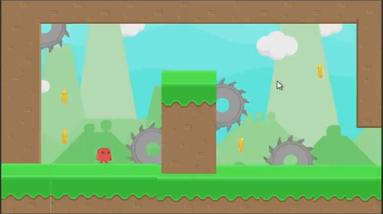 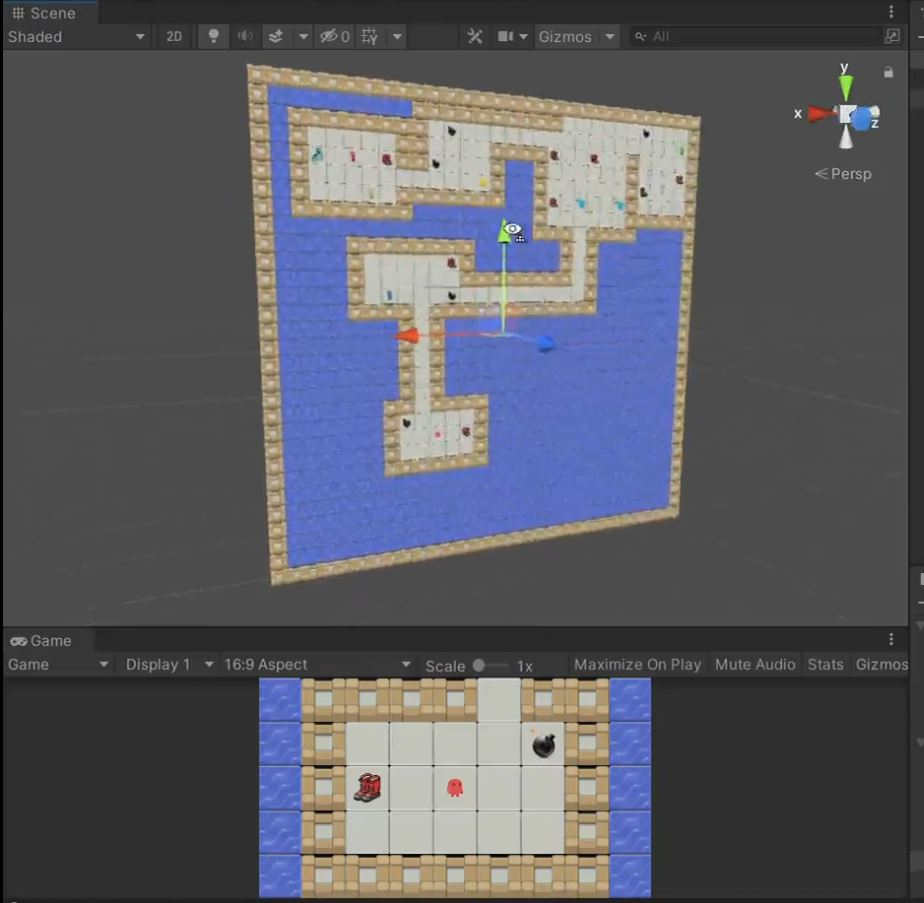 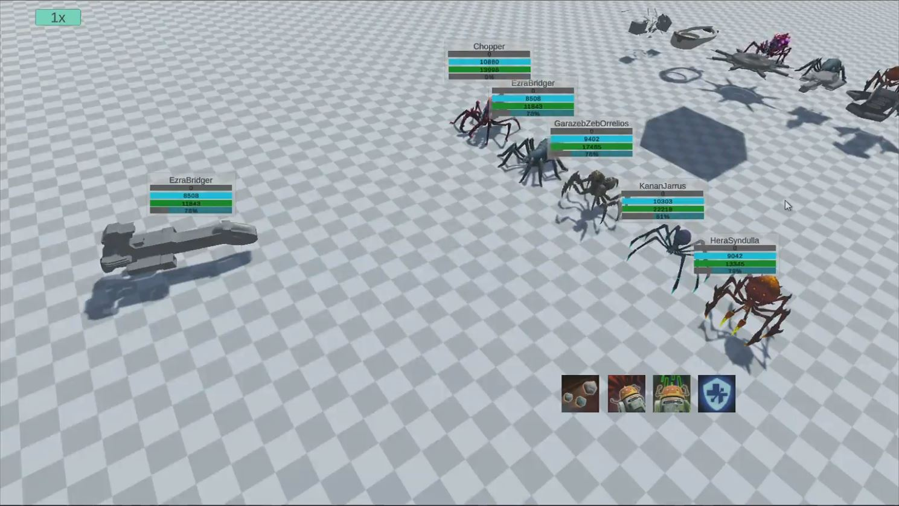

* **Unity Workshop 1**: ([Github Link](https://github.com/Squirrelbear/IntroductionWorkshop)) ([Youtube Presentation](https://youtu.be/vTAl86nATZI)): Materials I developed to teach introduction to Unity. This workshop focuses on setting up the environment, creating objects, using prefabs, and introducing scripting.
* **Unity Workshop 2**: ([Github Link](https://github.com/Squirrelbear/Unity2DPlatformerWorkshop)) ([Youtube Presentation](https://youtu.be/wV72ehW9TuM)): Materials I developed to teach introduction to Unity. This workshop teaches the creation of a simple Platformer game. Additional extension topics include a procedurally generated platformer level, introduction to using the debugger and using GitHub on Windows with Unity. 
* **Unity Workshop 3**: ([Github Link](https://github.com/Squirrelbear/ThirdWorkshopDemoProject)) ([Youtube Presentation](https://youtu.be/uDfp9WcoFcY)): Materials I developed to teach introduction to Unity. In this workshop, I showed a breakdown of tower defence game components, a tower defence game, examples of using events in Unity, procedural generation of a dungeon in Unity with some talk about types of randomisation, and general tips for managing objects with principles to follow.
* **Unity Workshop 4**: ([Github Link](https://github.com/Squirrelbear/FourthWorkshopDemoProject)) ([Youtube Presentation](https://youtu.be/43KhMJGKtPs)): Materials I developed to teach introduction to Unity. In this final workshop, I showed examples of coroutines, using scriptable objects, examples of programming patterns used in game design (singleton pattern, observer pattern, command pattern, component pattern, flyweight pattern, and state pattern) and SOLID Principles with examples. To use the concepts taught, I also included a partial sample game based on mimicking Star Wars: Galaxy of Heroes using scriptable objects and coroutines to make a lot of the functionality.

* **God of War Mechanic Demo (WIP)**: ([Github Link](https://github.com/Squirrelbear/UnityTesting2021)) ([Youtube DevLog](https://youtu.be/Ix8kvoW7kLM)): This demo represents a vertical slice of work done to test Unity features, including URP, shader graph and visual effect graph. The demo has the player mimic a sequence used throughout the God of War game, where the player stands interacts with a device to make a platform move. Then the player can throw their axe at the object (by clicking on it) to freeze the component causing the platform to move and jump onto it before calling the axe back and making the platform move back up.

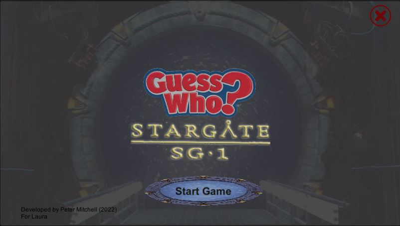 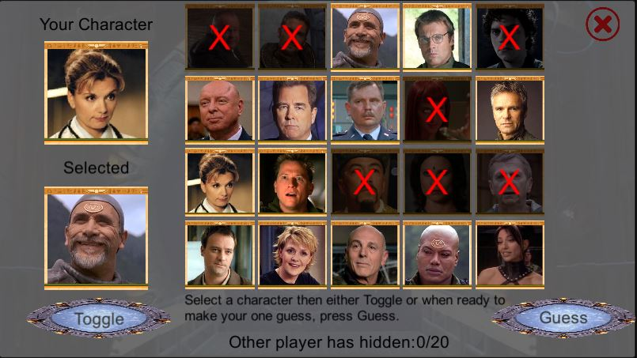

* **Guess Who: Stargate Unity Project**: ([Github Link](https://github.com/Squirrelbear/StargateGuessWho)): This project imitates the classic game of Guess Who with Stargate characters. Players can ask questions about the character the other has selected to narrow down the options until making a guess. The game is designed to work on both PC and Android.
* **Guess Who: Stargate NodeJS Server**: ([Github Link](https://github.com/Squirrelbear/StargateGuessWho-NodeJSServer)): This code acts as a server that lets users connect, authenticate, and join games for the Guess Who Stargate Unity project. The server manages any number of simultaneous games with pairs of users.

## Mobile Application Projects

* **Android Maze Game**: ([Github Link](https://github.com/Squirrelbear/AndroidMazeGame)): A simple game for Android utilising the gyroscope and accelerometer in Java.
* **Windows Phone Maze Game**: ([Github Link](https://github.com/Squirrelbear/WindowsPhoneMazeGame)): Same game as the Android Maze Game, except converted to use XNA with C# targetted to deploy to a Windows Phone.
* **Yellow Brick Road QR App**: ([Github Link](https://github.com/Squirrelbear/YellowBrickRoadQRApp)): A PHP based application designed for use by scanning QR codes that would take you to information pages relevant to the location where you were.
* **Trail Seeker**: ([Github Link](https://github.com/Squirrelbear/TrailSeeker)): A Java mobile application that uses GPS data to create trails that can be shared via a PHP server backend. 

## Other Projects

* **CASIO Calculator Applications**: ([Github Link](https://github.com/Squirrelbear/CasioApplications)): This contains a collection of Casio applications I wrote while in high school. These include both games and applications for simplifying calculations for math topics. My Blackjack game performed well on CasioKingdom.org, where it had many downloads before the site closed down.
* **CP1 Extras**: ([Github Link](https://github.com/Squirrelbear/CP1Extras)): A resource I continued to develop over 2020 and 2021 to provide help to first-year uni programming students.
* **The Waking**: ([Github Link](https://github.com/Squirrelbear/TheWaking-GameMaker6.1)) ([Youtube Demo](https://youtu.be/5rIMB6ml8nU)): A 3D zombie shooter developed using Game Maker 6.1 in 2006 that I collaborated on with a friend for a school IT project.
* **World of Warcraft Weakauras**: ([Wago.io Profile Link](https://wago.io/p/Squirrelbear)): Over the years, while playing World of Warcraft I have worked on many custom LUA/weakaura solutions to solve my day-to-day playing of the game. One of my favourite weakauras is the ([Warmode Up Warning](https://wago.io/ZgkJn5TM0)) weakaura designed to tell you if your party is in a different phase (warmode state) when forming groups.
* **Flinders Uni Crew MessengerPlus Utility**: ([GithubLink](https://github.com/Squirrelbear/FlindersUniCrewMSNPlusScriptsPublic)): A fun utility used as part of the Flinders Uni Crew group chat. I wrote this to allow for dynamic responses and remote execution based on various features. The script uses MPL Scripting based on an older version of Javascript. 
* **Flinders University Childcare Website (2008)**: I worked with a staff member at the childcare during 2008 to craft a suitable website for Flinders University's Childcare. My version of the website was available from between 2008 till mid-2016 when they updated the site authored by another separate individual. 
* **Ashenden's at Penneshaw**: ([Site Link](http://www.ashendensatpenneshaw.com/)): A website I developed in 2011 for a client wishing to advertise their Kangaroo Island property as holiday accomodation. The current version of the website is as of February 2022 still mostly the same with some images and text modified from my original work.
* **PHP CMS with Forums and Messaging**: ([Github Link](https://github.com/Squirrelbear/PHP-CMS-Forum-Messaging)): A project I wrote around 2008 to practice PHP by developing my own forum/messaging/file upload utilities.

## Publications and Documents

* **PhD Conference Publication**: ([Github Link to Paper](https://github.com/Squirrelbear/SecondExperimentPhD/blob/main/ConferencePaper.pdf)) ([ACM Link](https://dl.acm.org/doi/10.1145/3010915.3010964)): This paper covers the preliminary discussion about my Periphery Vision Menu System after conducting my second experiment as part of my PhD. The reference for this paper would appear as:
	- Mitchell P. and Wilkinson B. 2016, “Periphery triggered menus for head mounted menu interface interactions”, in Proceedings of the 28th Australian Conference on Computer-Human Interaction, OzCHI’16, pp. 30-33, Tasmania, Australia.
* **PhD Thesis**: ([Abstract Library Link](https://theses.flinders.edu.au/view/db0bb3da-ee0e-45cb-a09a-86ba6ffb47fc/1)) ([Direct Thesis Link](https://flex.flinders.edu.au/items/db0bb3da-ee0e-45cb-a09a-86ba6ffb47fc/1/?.vi=file&attachment.uuid=e18a9122-c2d5-4908-8e2c-f4b6b63bbcfb)): See the abstract link for just the abstract and landing page on the official Flinders University Theses page. The direct link is also provided on the abstract page.
* **Honours Thesis**: ([Github Link to Thesis](https://github.com/Squirrelbear/Honours-BCI-and-Kinect-Game/blob/main/Thesis.pdf)): A copy of my full honours thesis that was awarded first class honours for my work using the Microsoft Kinect motion sensor and Emotic Epoc brain-computer interface. You can find the link to the full project under the XNA heading.
* **Honours Conference Presentation**: ([Github Link to Paper Content](https://github.com/Squirrelbear/Honours-BCI-and-Kinect-Game/blob/main/iTagPaper.pdf)) ([Presentation Slides](https://www.slideshare.net/iTAG_conf/evaluation-of-a-natural-user-interaction-gameplay-system-using-the-microsoft-kinect-augmented-with-noninvasive-brain-computer-interfaces)): The work for my honours was presented at ITAG 2013 October at Nottingham, United Kingdom. The slides for all presentations were made available via links such as the Presentation Slides link, but the paper content is not searchable. I have included both for full context. Had this been a searchable paper the reference would have been:
	- Mitchell P., Wilkinson B., Fitzgibbon S., and Sambrooks L. 2013, "Evaluating brain signal input for Kinect-based games", in the Proceedings of Interactive Technologies and Games: Education, Health and Disability, ITAG 2013, Nottingham, United Kingdom.

