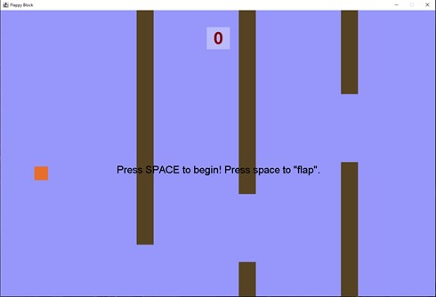

# Portfolio Demonstrating Peter Mitchell's Work

## Media Links

<a href="https://www.linkedin.com/in/petermitchell0001">LinkedIn</a> | <a href="https://github.com/Squirrelbear">GitHub</a> | <a href="https://www.facebook.com/petejm01">Facebook</a> | <a href="https://twitter.com/Squirrelbear1">Twitter</a>   <a href="https://www.youtube.com/channel/UCVpOx4ucRLUmX5Cx66kmyLA">YouTube (Professional)</a> | <a href="https://www.youtube.com/channel/UCBSBiO8jZeZJ7YcequpRmGA">YouTube (Personal Gaming)</a>

## Projects Overview

The following list of projects is a selection from those I have worked on in the past years. Some provide links to the repositories if I have made them public or provide a brief description. 

<ul>
	<li><a href="#java-projects">Java Projects</a></li>
	<li><a href="#xna-projects">XNA Projects</a></li>
	<li><a href="#unity-projects">Unity Projects</a></li>
	<li><a href="#other-projects">Other Projects</a></li>
</ul>

## Java Projects

I have developed all the games listed under Java Projects to make them easier to code for students. None of the games use any sprites; they are all rendered by making draw calls directly onto JPanels. A couple of non-game related projects are listed first.

* **Java Test Framework**: ([Github Link](https://github.com/Squirrelbear/Java-Test-Framework)): A tool to allow students to test the output of their university practical code.

* **Data Visualiser** ([Github Link](https://github.com/Squirrelbear/DataVisualiserPractical)) ([Youtube Practical Intro](https://youtu.be/Co_E2fda4Nw)): A practical designed for students to visually observe searching and sorting algorithms. Uses multithreading and reflection to give students a responsive plug and play experience.

   

* **Uno**: ([Github Link](https://github.com/Squirrelbear/Uno))  ([Youtube Demo](https://youtu.be/6feJMIqSF98)): A clone functionally similar to the official Uno game on Steam played vs AI.
* **Minesweeper**: ([Github Link](https://github.com/Squirrelbear/Minesweeper)) ([Youtube Demo](https://youtu.be/DvsNwkEJrzc)): Designed as both a GUI and CLI with step by step instructions for students.

   

* **Pacman**: ([Github Link](https://github.com/Squirrelbear/Pacman)) ([Youtube Demo](https://youtu.be/tH0pUULsx2o)): An implementation of the classic Pacman game with the best known level. AI is designed to mimic original logic.
* **TestTube**: ([Github Link](https://github.com/Squirrelbear/TestTube)) ([Youtube Demo](https://youtu.be/vdU5us7QbQY)): A clone of a water puzzle game where the aim is to fill test tubes fully with single colours.
* **Breakout**: ([Github Link](https://github.com/Squirrelbear/Breakout)) ([Youtube Demo](https://youtu.be/4UtAEuN2wGE)): A simple breakout clone with a bouncing ball and bricks with varying numbers of hits necessary to break them.

  

* **Match 3 Game**: ([Github Link](https://github.com/Squirrelbear/Match3Game)) ([Youtube Demo](https://youtu.be/YxQATWG95i0)): A game with similar functionality to classics like Bejeweled.
* **Frogger**: ([Github Link](https://github.com/Squirrelbear/Frogger)) ([Youtube Demo](https://youtu.be/Exx21n8kh3w)): Simple Frogger game where you try and get 4 frogs over a busy road and over water with logs and turtles.
* **RPG Text Game**: ([Github Link](https://github.com/Squirrelbear/RPGTextGame)) ([Youtube Demo](https://youtu.be/7o3ZetXnE3g)): A CLI RPG game where you traverse an ASCII map and try to clear all encounters that have turn-based combat where you use mana to cast abilities to defeat the enemies. The game is designed with a step by step set of instructions included to allow students to complete everything themselves.
* **FlappyBlock**: ([Github Link](https://github.com/Squirrelbear/FlappyBlock)) ([Youtube Demo](https://youtu.be/JSSfoseU8CQ)): A simplistic take on Flappy Bird where you play as a flying block. 
* **Blackjack**: ([Github Link](https://github.com/Squirrelbear/Blackjack)): A text-based game playing Blackjack against the computer.

  

* **Battleship**: ([Github Link](https://github.com/Squirrelbear/Battleship)) ([Youtube Demo](https://youtu.be/BaLBZEwchQY)): Battleship played against AI with three levels of difficulty posing increasing levels of challenge.
* **Tower Defence Game**: ([Github Link](https://github.com/Squirrelbear/TowerDefenceGame)) ([Youtube Demo](https://youtu.be/llbEwzDPGMo)): This is a simple tower defence game that focuses on the essential elements with three types of towers and three types of enemies.
* **TicTacToe**: ([Github Link](https://github.com/Squirrelbear/TicTacToe)) ([Youtube Demo](https://youtu.be/uv9m0cjglIY)): Tic Tac Toe with the ability to play against a simple AI or against another player.

   

* **Tetris**: ([Github Link](https://github.com/Squirrelbear/Tetris)) ([Youtube Demo](https://youtu.be/8Sry1YbaXWY)): A simple Tetris clone that focuses on providing the core experience.
* **Space Invaders**: ([Github Link](https://github.com/Squirrelbear/SpaceInvaders)) ([Youtube Demo](https://youtu.be/LGGnLAnUXvg)): Has enemies moving down to invade while the player fires back at them with a simple tank.
* **Snake**: ([Github Link](https://github.com/Squirrelbear/Snake)) ([Youtube Demo](https://youtu.be/EI8MILz4auI)): Apples spawn in 3s and can be eaten by the snake to grow in length and gradually move faster.
* **Rhythm Master**: ([Github Link](https://github.com/Squirrelbear/RhythmMaster)) ([Youtube Demo](https://youtu.be/4x6l2AiYHOM)): Similar to games like Guitar Hero where you have to press keys close to the transition point at the bottom of the screen. Score is granted based on how well keys are pressed.
* **Pong**: ([Github Link](https://github.com/Squirrelbear/Pong)) ([Youtube Demo](https://youtu.be/b3IgHdTLo8k)): 2 player pong, played using the keyboard.
* **Othello**: ([Github Link](https://github.com/Squirrelbear/Othello)) ([Youtube Demo](https://youtu.be/gIGlct4bAQs)): The game Othello played against either another player or the computer. You play by placing pieces of your colour in positions to capture pieces of the other colour.
* **Master Mind**: ([Github Link](https://github.com/Squirrelbear/MasterMind)) ([Youtube Demo](https://youtu.be/WPtMUdLuFFg)): Played by making guesses and making informed changes to guesses from knowing the number of pieces that are correct based on colour and/or position.

 

* **Word Master**: ([Github Link](https://github.com/Squirrelbear/WordMaster)) ([Youtube Demo](https://youtu.be/sClFZwInyvM)): A typing game where you try to type as many words as possible, as fast as possible, with as much accuracy as possible.
* **Car Dodger**: ([Github Link](https://github.com/Squirrelbear/CarDodger)): A mouse controlled game where you change lanes to dodge as many oncoming cars as possible.
* **Platformer**: ([Github Link](https://github.com/Squirrelbear/Platformer)) ([Youtube Demo](https://youtu.be/ctRTWqbMZ9g)): A simple platformer with platforms, collectibles, spikes, and an endpoint.

## XNA Projects

  

* **Chad's Challenge** ([Github Link](https://github.com/Squirrelbear/ChadsChallengeDemoCopy)) ([YouTube Level Editor Demo](https://youtu.be/dIvHmNC0zoc)) ([Youtube Gameplay Demo](https://youtu.be/BkuVXLOpa20)): A group project I led while simultaneously developing Stargate Galaxy (under Unity Projects). The game cloned the mechanics of Chip's Challenge while also adding new enemies, mechanics, and a level editor. I was responsible for managing the team, approving code merges, developing the core game systems, including data structures and methods for the editor, and designing custom levels, among other roles.
* **XNA Tools** ([Github Link](https://github.com/Squirrelbear/XNATools)): XNA Tools is a framework for simplifying development in XNA. Developed from some code I wrote part of Chad's Challenge, and then used in Kirby Arena, Splashboard, my Honour's project, and a number of other projects.

  

* **Kirby Arena** ([Github Link](https://github.com/Squirrelbear/KirbyArenaPublic)) ([Youtube Demo](https://youtu.be/oxCJZz_r7_4)): A quirky battle game where Kirby fights Kirby with any combination of AI vs AI, Player vs Player, or Player vs AI. Uses my XNA tools as a framework and has four different levels with various powerups and ways to win.
* **Splashboard** ([Vimeo Example Gameplay](https://vimeo.com/user19868725)) (Kinect Virtual Art Program): Not a program I developed myself, but I provided my XNA Tools as the framework and assisted with converting the original C++ code into C#. Along with extending the library to provide additional support for necessary functions requested.

  

* **Honours Project** ([Github Link](https://github.com/Squirrelbear/Honours-BCI-and-Kinect-Game)) ([Youtube Demo](https://youtu.be/CxklsQ8ch8A)): My honours project investigated the use of relaxation/concentration by using the Emotiv Epoc BCI interface combined with gesture detection with the Microsoft Kinect and voice commands via the Microsoft Kinect using their speech libraries. I developed custom algorithms with three games that effectively used the inputs and tested them on participants.

## Unity Projects

* **Experiment 1**: ([Github Link](https://github.com/Squirrelbear/PhD-First-Experiment)) ([Youtube Demo](https://youtu.be/OF3ZlTPa5rg)): A prelimary study into using VR for object manipulation and interaction. 
* **Experiment 2**: ([Github Link](https://github.com/Squirrelbear/SecondExperimentPhD)) ([Youtube Demo](https://youtu.be/6USVv6UwX9Y)) ([Youtube Game Trailer](https://youtu.be/7R2cSl9IyD8)): A prototype test of my Periphery Vision Menu System with VR including calibration evaluation, and a tower defence game.
* **Experiment 3**: ([Github Link](https://github.com/Squirrelbear/ThirdExperimentPhD)) ([Youtube Demo](https://youtu.be/SKLK-2wC5jM)) ([Youtube Game Trailer](https://youtu.be/bVtB0wj8ehI)): An improved prototype test of my Periphery Vision Menu System with VR including object manipulation and a tower defence game.

  

* **Stargate Galaxy** ([Github Link](https://github.com/Squirrelbear/StargateGalaxy)) ([Youtube Demo](https://youtu.be/YiR4QwfVw_I)): A game I lead development on while at the same time also leading development on Chad's Challenge (see XNA Projects). My roles involved project manager, lead programmer, lead AI programmer, lead tester, co-lead documentation editor, and I was responsible for other elements such as merging the work of others into a single cohesive project. The game puts you in the Stargate setting with many ships and many more planets to travel to and attack or defend as an Earth faction player. 

* **Unity Workshop 1**: ([Github Link](https://github.com/Squirrelbear/IntroductionWorkshop)): Materials I developed to teach introduction to Unity. This workshop focuses on setting up the environment, creating objects, using prefabs, and introducing scripting.
* **Unity Workshop 2**: ([Github Link](https://github.com/Squirrelbear/Unity2DPlatformerWorkshop)): Materials I developed to teach introduction to Unity. This workshop teaches the creation of a simple Platformer game. Additional extension topics include a procedurally generated platformer level, introduction to using the debugger and using GitHub on Windows with Unity. 
* **Unity Workshop 3**: ([Github Link](https://github.com/Squirrelbear/ThirdWorkshopDemoProject)): Materials I developed to teach introduction to Unity. In this workshop, I showed a breakdown of tower defence game components, a tower defence game, examples of using events in Unity, procedural generation of a dungeon in Unity with some talk about types of randomisation, and general tips for managing objects with principles to follow.
* **Unity Workshop 4**: ([Github Link](https://github.com/Squirrelbear/FourthWorkshopDemoProject)): Materials I developed to teach introduction to Unity. In this final workshop, I showed examples of coroutines, using scriptable objects, examples of programming patterns used in game design (singleton pattern, observer pattern, command pattern, component pattern, flyweight pattern, and state pattern) and SOLID Principles with examples. To use the concepts taught, I also included a partial sample game based on mimicking Star Wars: Galaxy of Heroes using scriptable objects and coroutines to make a lot of the functionality.

## Other Projects

* **CASIO Calculator Applications**: ([Github Link](https://github.com/Squirrelbear/CasioApplications)): This contains a collection of Casio applications I wrote while in highschool. These include both games and applications for simplifying calculations for math topics. A couple of the games I had put on CasioKingdom.org where my Blackjack game had many downloads before the site closed down.
* **CP1 Extras**: ([Github Link](https://github.com/Squirrelbear/CP1Extras)): A resource I continued to develop over 2020 and 2021 to provide a resource I was constantly updating for first year uni programming students.
* Summer Scholarship SSVEP
* Ashenden's at Penneshaw (2011)
* Flinders University Childcare Centre (2011)
* Flinders University Yellow Brick Road Mobile QR Code Web App (College of Science, Engineering and Mathematics)
* Flinders University QR Code Room Booking Viewer (College of Science, Engineering and Mathematics)
* Any other GitHubs that are not already listed
