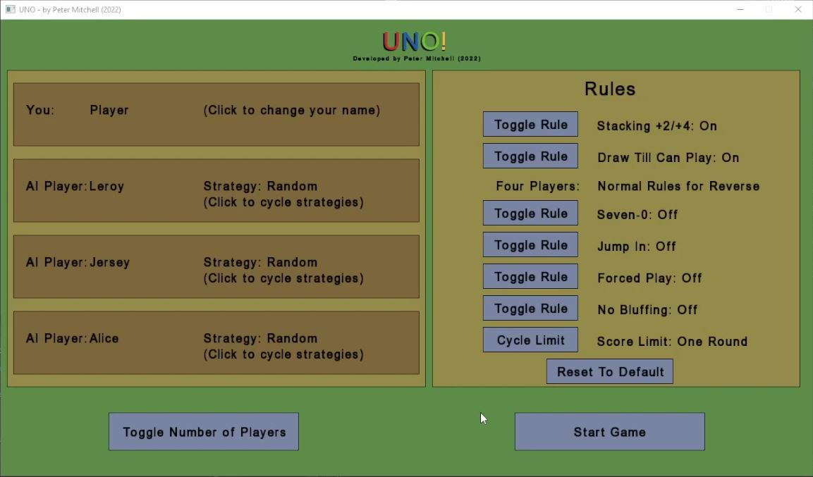
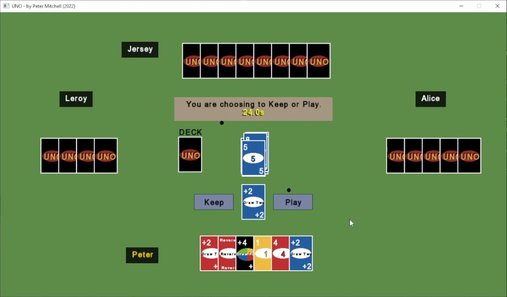
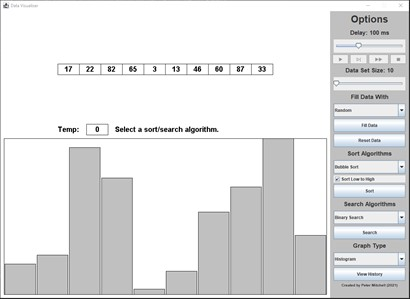
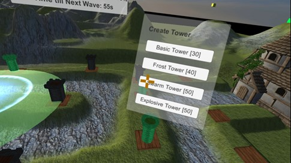
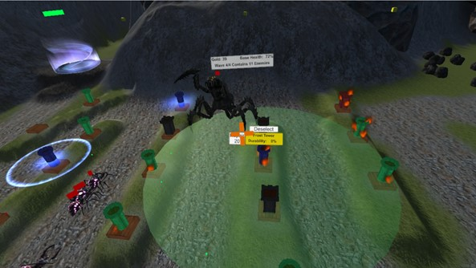
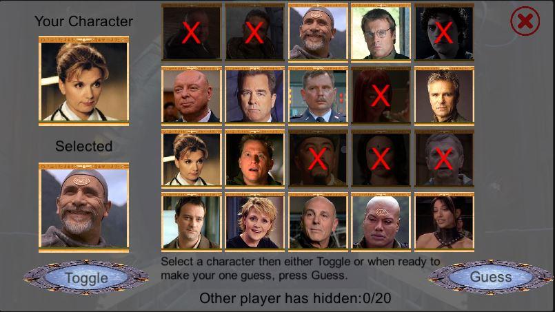
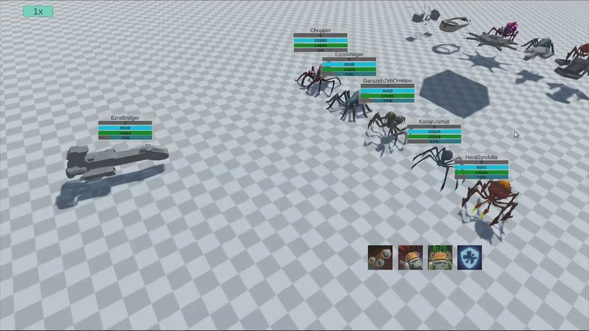
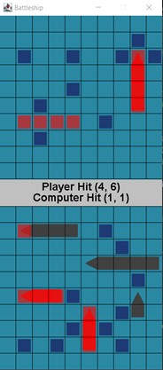

# 10 Interesting Examples from my Portfolio 

[Return to Portfolio](./index)

## Uno (Game Sequence and AI)

 

* ([C++ Github Link](https://github.com/Squirrelbear/Uno-CPP)) 
* ([C++ Version Youtube Demo](https://youtu.be/FrpcG1bfcx4)) 
* ([Java Github Link](https://github.com/Squirrelbear/Uno))
* ([Java Version Youtube Demo](https://youtu.be/6feJMIqSF98))

Written in both C++ and Java, my version of UNO allows the choice of all the standard types of rules (stacking, drawn till can play, jump in, seven-zero etc.). A tree is constructed for each new sequence to handle these rules and the decisions required from the player and AI (starting with playing a card or drawing a card). The nodes operate decision logic, waiting for a decision from the defined rules, the player or the AI. The AI runs on a chance-based system where they decide to respond to events present in the game, including calling UNO and calling out others for not calling UNO.

## Chad’s Challenge (Game Framework, Level Editor, and AI)

  

* ([Github Link](https://github.com/Squirrelbear/ChadsChallengeDemoCopy)) 
* ([YouTube Level Editor Demo](https://youtu.be/dIvHmNC0zoc)) 
* ([Youtube Gameplay Demo](https://youtu.be/BkuVXLOpa20))

Chad’s Challenge game mimics the classic “Chip’s Challenge” game written in C# with XNA. Some of my core responsibilities on this group project were developing the underlying framework to handle how elements interacted and ensuring it functioned simultaneously as a level editor. The framework represents the 2D grid of cells where entering and exiting cells provide definable actions for blocks and monsters. These cells have definable rules for checking if entry or exit on each side is allowed. These rules are implemented in the A* pathing used by the AI.

## Kirby Arena (AI)

  

* ([Github Link](https://github.com/Squirrelbear/KirbyArenaPublic)) 
* ([Youtube Demo](https://youtu.be/oxCJZz_r7_4))

Kirby Arena represents a game where I drew a significant amount of art with only Kirby itself drawn by a friend,alongside writing all the C# XNA code necessary for the game. The game allows for Player vs Player, Player vs AI, and AI vs AI modes. The AI evaluates the current game state and uses a scoring system to consider what action it should perform. The AI can do everything the player can except the suck action to suck up a distant object. The objects currently spawned everywhere in the level, the threat presented by the other player, the status of temporary effects and more are all used to decide the best decision at a given moment.

## God of War (Gameplay Mechanics)

* ([Github Link](https://github.com/Squirrelbear/UnityTesting2021)) 
* ([Youtube DevLog](https://youtu.be/Ix8kvoW7kLM))

God of War has a sequence of actions used multiple times throughout the game where you need to interact with something and throw your axe to freeze an object holding it in place. This example demonstrates a character stepping onto a button, causing a roller to move and a platform to move down. The player can click on the roller to throw their axe, triggering a freeze over visual using a shader and additional models to show it has been locked in place. While frozen, the player can move off the button and jump onto the platform the recall their axe resulting in the platform moving where the player needs to travel next.

## Data Visualiser (UI Multithreading and Reflection)

* ([Github Link](https://github.com/Squirrelbear/DataVisualiserPractical)) 
* ([Youtube Practical Intro](https://youtu.be/Co_E2fda4Nw))

I developed the application to be an easy to use plug-and-play experience for novice programmers to write sort/search algorithms in Java and then see the animated sequence of actions. Reflection is used to detect algorithms students define for automatic loading with no code necessary outside the inheritance of the base search or sort algorithm class. Once a user starts an algorithm, it is managed by a separate thread to enable interaction with the UI allowing for dynamically changing the speed, using step-through operations, pausing entirely, or cancelling. Data is generated and stored as a summary of every algorithm execution that can be automatically parsed into a report summarising swaps, comparisons, and more.

## Java Test Framework (Output Analysis)

* ([Github Link](https://github.com/Squirrelbear/Java-Test-Framework))

Students in first-year programming would routinely call over tutors to mark off work when their code doesn’t output everything correctly. I wrote the Java Test Framework to let students generate feedback on their output and introduce them to the idea of testing. The framework uses defined test cases with input and expected output. The output from a student’s program is captured and analysed against the expected output with any differences reported clearly. This system also allows easy marking for tutors as they can see it passes all test cases. In addition to the framework deployed to students with each practical task set, I developed a test creation tool that supports automatic expected output generation. 

## PhD Experiments (Interface, Interaction, VR, Replays)

  

* ([First Experiment Github Link](https://github.com/Squirrelbear/PhD-First-Experiment)) 
* ([First Experiment Youtube Demo](https://youtu.be/OF3ZlTPa5rg))
* ([Second Experiment Github Link](https://github.com/Squirrelbear/SecondExperimentPhD))
* ([Second Experiment Youtube Demo](https://youtu.be/6USVv6UwX9Y))
* ([Second Experiment Youtube Game Trailer](https://youtu.be/7R2cSl9IyD8))
* ([Third Experiment Github Link](https://github.com/Squirrelbear/ThirdExperimentPhD))
* ([Third Experiment Youtube Demo](https://youtu.be/SKLK-2wC5jM))
* ([Third Experiment Youtube Game Trailer](https://youtu.be/bVtB0wj8ehI))

My PhD experiments demonstrate the use of world-space menus triggered in VR with head rotation. Much of the second and third experiments’ evaluation was related to using a tower defence game. The experiments included recording the movement and interactions, allowing replay using the telemetry data generated from a user playing.

## Honours Project (BCI, Interaction, Gameplay)

  

* ([Github Link](https://github.com/Squirrelbear/Honours-BCI-and-Kinect-Game))
* ([Youtube Demo](https://youtu.be/CxklsQ8ch8A))

I combined a brain-computer interface with the Microsoft Kinect in my honours project. The brain input was used in the application to measure concentration/relaxation. The first puzzle, for example, involved a grid of 3x3 tiles with a hidden map of the world. The user would have to relax, and as a result, the world map would fade in over the top of the heiroglphs. Voice commands and hand interactions could select, pick up, rotate, and put down the tiles. The goal was to reform the world map correctly. As users began to perform interactions, this would sway them more toward concentration causing the map to fade out again.

## Guess Who Stargate (Multiplayer)

 

* ([Unity Client Project Github Link](https://github.com/Squirrelbear/StargateGuessWho))
* ([NodeJS Server Project Github Link](https://github.com/Squirrelbear/StargateGuessWho-NodeJSServer))

This project imitates the classic game of Guess Who with Stargate characters. Players can ask questions about the character the other has selected to narrow down the options until making a guess. The game is designed to work on both PC and Android.

## Star Wars: Galaxy of Heroes (Gameplay)

* ([Github Link](https://github.com/Squirrelbear/FourthWorkshopDemoProject)) 
* ([Youtube Presentation](https://youtu.be/43KhMJGKtPs)): Note that the presentation of this content starts at 48:30 if you want to skip to it.

As part of teaching game development in 2021, I developed a mini-experience replicating the flow of the game Star Wars: Galaxy of Heroes. The demo implements a small selection of abilities for the Phoenix squad represented as spiders. Although the construction of abilities was handled with scriptable objects, I would prefer to use a node or LUA based technique for a complete game. The purpose of the example was to demonstrate different ways to use scriptable objects. Characters, abilities, buffs/debuffs, and actions performed as part of abilities are all represented as scriptable objects linked together, creating a similar experience to expected gameplay.

## (Bonus 11) Top 3 Most Viewed on Youtube Demos (Battleship, Othello, Wordle)

  

* ([Othello Java Github Link](https://github.com/Squirrelbear/Othello)) 
* ([Othello Youtube Demo](https://youtu.be/gIGlct4bAQs))
* ([Battleship Java Github Link](https://github.com/Squirrelbear/Battleship)) 
* ([Battleship Youtube Demo](https://youtu.be/BaLBZEwchQY))
* ([Wordle C++ Github Link](https://github.com/Squirrelbear/Wordle-CPP-SMFL)) 
* ([Wordle Youtube Demo](https://youtu.be/18llxWL9dl4))
* ([Wordle Youtube Full Code Walkthrough](https://youtu.be/XJdb2gwaB3E))

Interestingly, these three applications have had the most views on my youtube channel out of all applications. 

[Return to Portfolio](./index)